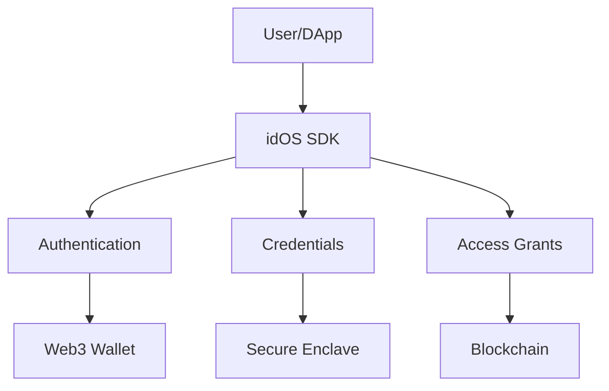

# idOS SDK JavaScript Repository AI Brief

## Quick Start for AI Agents

### Common Tasks and Solutions
1. Adding new credential functionality
   - Check `packages/idos-sdk-js/src/credentials/` for existing implementations
   - Follow patterns in `packages/idos-sdk-js/src/credentials/types.ts`
   - Update tests in corresponding `.test.ts` files
   - Validate against `packages/@core/src/schemas/`

2. Modifying authentication flows
   - EVM changes: Check `packages/idos-sdk-js/src/auth/evm/`
   - NEAR changes: Check `packages/idos-sdk-js/src/auth/near/`
   - Always maintain backward compatibility
   - Test with both mainnet and testnet configurations

3. Updating UI components
   - Core components in `apps/idos-enclave/src/components/`
   - Dashboard components in `apps/idos-data-dashboard/src/components/`
   - Follow existing styling patterns
   - Test across different wallet providers

### Required Pre-check Files
- `.env` files for environment configuration
- `package.json` for dependencies
- `tsconfig.json` for TypeScript settings
- `vitest.config.ts` for test configuration
- Corresponding test files for modified components

### Critical Environment Variables
```bash
NODE_URL=https://nodes.idos.network
NETWORK=testnet  # or mainnet
DEBUG=true  # for development
```

## Repository Navigation Guide

### Directory Structure
```
packages/
  idos-sdk-js/      # Main SDK implementation
  issuer-sdk-js/    # Issuer-specific functionality
  consumer-sdk-js/  # Consumer-specific functionality
  @core/           # Shared utilities and types
  @controllers/    # Web application controllers

apps/
  idos-enclave/         # Secure browser context
  idos-data-dashboard/  # Main dashboard application
  isle/                 # Owner flow management
  dashboard-for-dapps/  # DApp integration dashboard

examples/           # Implementation examples
  consumer-and-issuer/
  passporting/
  isle-demo/
```

### Key File Relationships
- Core types → Package implementations → Application usage
- Schema definitions → Validation implementations → Runtime checks
- Controller definitions → UI components → User interactions

### Testing Patterns
- Unit tests: Adjacent to source files (`*.test.ts`)
- Integration tests: In `apps/idos-sdk-e2e/specs/`
- Component tests: Within each app's test directory
- Mock data: Shared in `packages/@core/src/test/`

## Development Workflow

### Adding New Features
1. Define types in appropriate `@core` package
2. Implement core logic in relevant SDK package
3. Add comprehensive tests
4. Update documentation
5. Create example implementation

### Making Changes
1. Review related test files first
2. Make changes with test coverage
3. Validate against example applications
4. Check for breaking changes
5. Update documentation

### Validation Steps
1. Run test suite: `pnpm test`
2. Check type consistency: `pnpm type-check`
3. Verify examples: `pnpm build && pnpm test:e2e`
4. Validate documentation accuracy

## System Architecture

### Component Interactions


### Security Boundaries
1. Enclave Operations
   - Password input
   - Key derivation
   - Encryption/decryption
   - Never expose keys or sensitive data

2. Wallet Interactions
   - Signature requests
   - Chain-specific validations
   - Transaction handling

3. Data Protection
   - Encrypted storage
   - Access control
   - Permission validation

## Technical Components

### Core SDK Packages
- `packages/idos-sdk-js`: Main JavaScript SDK
  - Authentication handlers
  - Credential management
  - Access control
  - Chain interactions

- `packages/issuer-sdk-js`: Issuer functionality
  - Credential creation
  - Validation logic
  - Revocation management

- `packages/consumer-sdk-js`: Consumer features
  - Credential requesting
  - Access grant management
  - Data consumption

- `packages/@core`: Shared utilities
  - Type definitions
  - Schema validation
  - Common utilities

### Applications
- `apps/idos-enclave`: Secure browser context
  - Password handling
  - Key derivation
  - Cryptographic operations

- `apps/idos-data-dashboard`: Main dashboard
  - Credential management
  - Access control
  - User settings

### Authentication & Security
- Web3 wallet integration (EVM/NEAR)
- EIP-191 and NEP-413 signatures
- Secure enclave operations
- Password/passkey encryption

### Main Features
1. Credential System
   - CRUD operations
   - Encrypted storage
   - Verifiable credentials
   - Access control

2. Permission Management
   - Delegated Write Grants
   - Access Grants
   - Timelock revocation
   - Permission inheritance

## Troubleshooting Guide

### Common Error Patterns
1. Authentication Errors
   - Check wallet connection
   - Verify network configuration
   - Validate signature format
   - Confirm chain compatibility

2. Credential Operations
   - Verify encryption key availability
   - Check access permissions
   - Validate credential format
   - Confirm storage state

3. Access Grant Issues
   - Verify timelock status
   - Check grant permissions
   - Validate chain state
   - Confirm signature validity

### Debugging Steps
1. Enable debug mode in configuration
2. Check browser console for detailed logs
3. Verify network requests in DevTools
4. Validate state in blockchain explorer

### Recovery Procedures
1. Authentication Issues
   - Clear local storage
   - Reconnect wallet
   - Verify network status

2. Credential Access
   - Verify encryption keys
   - Check access grants
   - Validate permissions

3. Transaction Failures
   - Check gas settings
   - Verify network status
   - Validate input data

## Best Practices

### Code Modifications
- Always maintain type safety
- Add comprehensive tests
- Document changes
- Consider backward compatibility

### Security Considerations
- Never expose encryption keys
- Validate all signatures
- Handle user cancellation
- Implement proper error handling

### Performance Optimization
- Batch blockchain operations
- Implement proper caching
- Optimize cryptographic operations
- Handle concurrent requests

## Support & Documentation
- Package documentation in respective README.md files
- Example implementations in examples/ directory
- Support process: https://github.com/idos-network/.github/blob/main/profile/README.md
