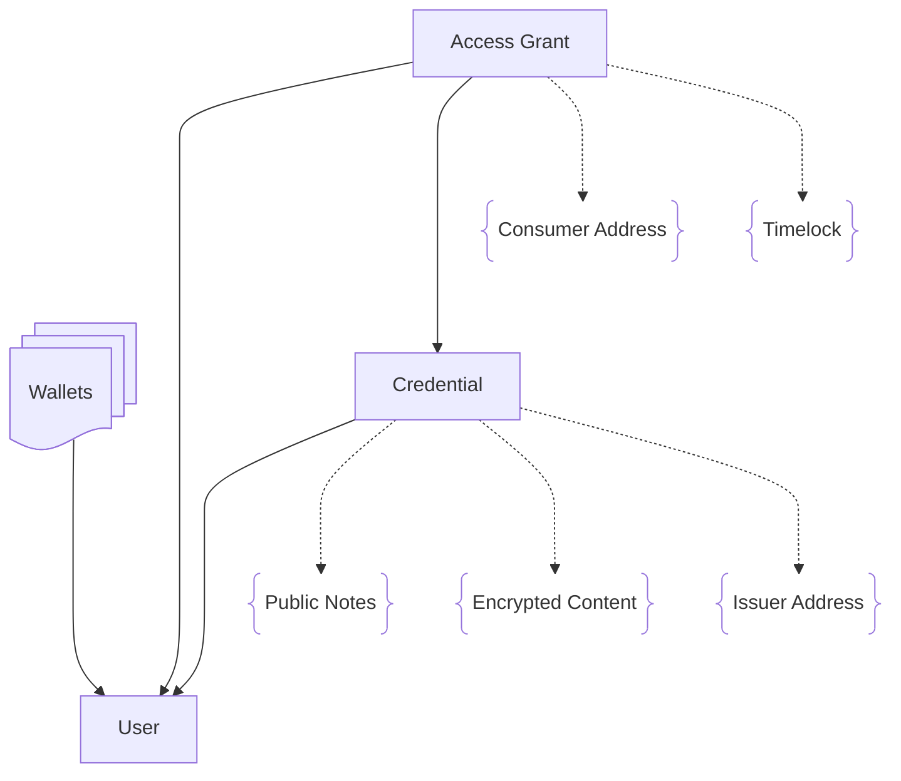

# idOS's Overview

## Actors
- Owner (or User)
  The people whose data we're safekeeping. They authenticate with their network-native wallet. To encrypt and decrypt their data, they use the idOS Enclave.
- Issuer
  Entities that issue credentials. They are responsible for ensuring accuracy and compliance of the information that a credentials contains that characterizes a user.
- Consumer
  Entities that consume credentials. These credentials need to first be shared by the user through an access grant.

## Central concepts

Here's the overview diagram of the central concepts in idOS.

Text surrounded by braces denotes a field.

- User
- Wallet
- Credential
  - Public Notes
    - Public notes are editable by the issuer (e.g., for signaling revocation).
  - Encrypted Content
  - Issuer Address
- Access Grant
  - Owner (user)
  - Credential
  - Consumer Address
  - Timelock
- Attributes
- Account Creators

Note that Issuers and Consumers aren't directly conceptualized in idOS, but only identified by their addresses.

The only notable exception to this are Account Creators: a limited pool of Issuers (which can have multiple addresses) that have permission to create idOS Users. Once idOS's Economy is in place, this concept will become deprecated.

## Components

- idOS Storage Network Nodes
    - Based on Kwil
    - Has some idOS-specific extension functions (see https://github.com/idos-network/idos-kwild)
    - Functions according to its schema (see https://github.com/idos-network/idos-schema)
- User dashboard
- Dashboard for dapps
- idOS Enclave
- idOS Isle
- Passporting server

## Other stakeholders

- Legislative bodies
- Compliance officers
- idOS Governance Committee
