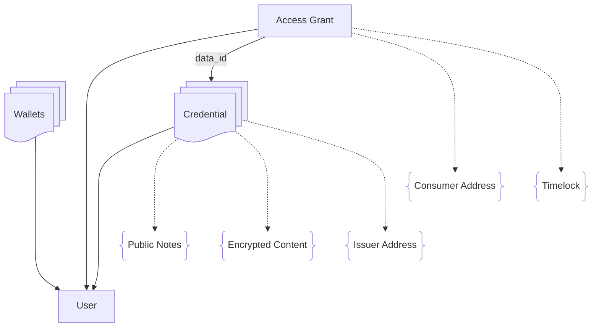

# idOS System Overview

The idOS platform is a decentralized identity system that enables secure storage, verification, and sharing of personal data through blockchain technology. It provides a framework for users to own their data while allowing trusted entities to store, access, and verify it in a privacy-preserving manner.

## Key Actors

- **Owner (User)**:
  The individuals whose data is securely managed by idOS. Users authenticate using their native blockchain wallets (EVM or NEAR-compatible). For data encryption and decryption operations, user use the idOS Enclave, a webapp running on its own browser origin, ensuring host apps cannot access plaintext data.

- **Issuer**:
  Organizations that verify user-provided data and issue credentials. Issuers are responsible for ensuring the accuracy, authenticity, and compliance of the information contained in credentials they issue. Examples include financial institutions, insurance companies, educational institutions, healthcare providers, government agencies, and other obliged entities and regulated service providers.

- **Consumer**:
  Applications or services that request access to user credentials. They can only access credential data after the user explicitly grants permission through creating an Access Grant. Consumers could be dApps, financial services, or any entity requiring verified data.

## Core System Architecture

Here's a visual representation of the key concepts and relationships in idOS:

*Note: Elements surrounded by braces represent fields within the connected entity.*

### Fundamental Data Structures

- **User Profile**:
  The central identity entity in the system, representing a unique person or organization. Users control their profiles through their blockchain wallets and manage how their data is shared.

- **Wallets**:
  Blockchain wallets that authenticate and authorize actions for a user. A user can link multiple wallets across different chains (EVM, NEAR) to their idOS profile to provide flexible authentication options.

- **Credential**:
  Verified claims or attestations about a user. Notable fields are:
    - **User**: The individual to whom this credential was issued and whose information the credential verifies.
    - **Public Notes**: Readable metadata that is visible to any platform where the user logs in to idOS. Issuers can update these notes, for example, to reflect the credential's revocation status.
    - **Encrypted Content**: The credential's core data, securely encrypted so that only the user and explicitly authorized parties can access it.
    - **Issuer Address**: The public key of the issuer's signer, which issued and signed the credential to ensure its authenticity and integrity.

  An unintuitive aspect of credentials is that they're encrypted specifically for one recipient. To share credential data, the user (or their authorized delegate) must retrieve their encrypted credential, decrypt it using their keys, re-encrypt it for the new recipient, and store this as a new credential that references the original. This process ensures end-to-end encryption while enabling controlled sharing.

- **Access Grant**:
  A user-authorized permission that allows a specific Consumer to access a credential's encrypted content:
  - **Owner**: The user who issued the grant
  - **Data ID**: ID of the specific credential being shared
  - **Consumer Address**: The recipient's address authorized to access the data
  - **Timelock**: An optional lock date before which the access grant can't be revoked. Useful for some compliance scenarios.

- **Attributes**:
  Additional public (to applications where the user logs in to idOS) key-value pairs associated with a user profile, providing configurable metadata.

- **Account Creators**:
  A designated set of trusted Issuers that have permission to create new idOS User profiles. This concept will be phased out as the idOS Economy matures.

While Issuers and Consumers are key actors in the system, they are primarily represented by their blockchain addresses, rather than as separate entity types in the data model.

## Components

- idOS Storage Network Nodes
    - Based on Kwil
    - Has some idOS-specific extension functions (see https://github.com/idos-network/idos-kwild)
    - Functions according to its schema (see https://github.com/idos-network/idos-schema)
- User dashboard
- Dashboard for dapps
- idOS Enclave
- idOS Isle
- Passporting server

## Other stakeholders

- Legislative bodies
- Compliance officers
- idOS Governance Committee
