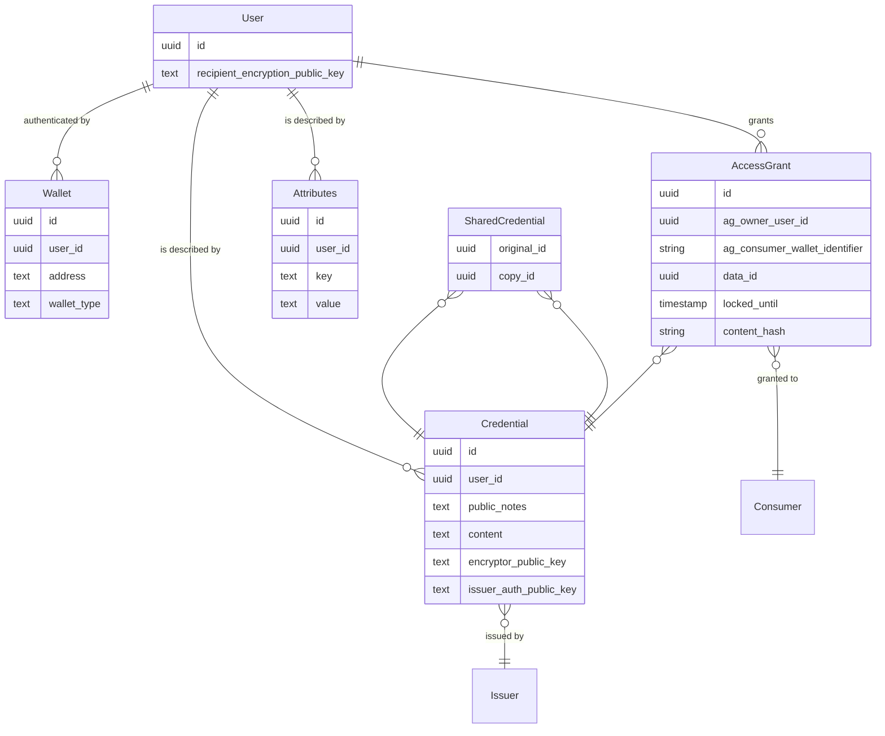

# idOS System Overview

The idOS is a decentralized identity system that enables secure storage, verification, and sharing of personal data through blockchain technology. It provides a framework for users to own their data while allowing trusted entities to store, access, and verify it in a privacy-preserving manner.

Note that idOS is (currently) a permissioned network. While it's (almost) fully open-source, only authorized operators can participate in it. This ensures that consequences (economical, legal, or as appropriate) can be pursued for ill-behaving nodes, ensuring that all node operators are well-incentivized to protect users' privacy and data sovereignty.

> 🚧 Will change soon 🚧
>
> That `(almost)` will disappear soon. We're in the process of preparing some repositories to become public.

> 🔭 Will change later on 🔭
>
> We'd rather not be a permissioned network. However, because storing encrypted text publicly is dangerous, until we find a secure way to do it, we're going to keep the network permissioned.

## Key Actors

- **Owner (User)**:
  The individuals whose data is securely managed by idOS. Users authenticate using their native blockchain wallets (EVM or NEAR-compatible). For data encryption and decryption operations, users use the idOS Enclave, a webapp running on its own browser origin, ensuring host apps cannot access plaintext data.

- **Issuer**:
  Organizations that verify user-provided data and issue credentials. Issuers are responsible for ensuring the accuracy, authenticity, and compliance of the information contained in credentials they issue. Examples include financial institutions, insurance companies, educational institutions, healthcare providers, government agencies, and other obliged entities and regulated service providers.

- **Consumer**:
  Applications or services that request access to user credentials. They can only access credential data after the user explicitly grants permission through creating an Access Grant. Consumers could be dApps, financial services, or any entity requiring verified data.

## Data Architecture

Here's an abridged visual representation of the key concepts and relationships in idOS:

### Fundamental Data Structures

- **User**:
  The central identity entity in the system, representing a unique person or organization. Users control their profiles through their blockchain wallets and manage how their data is shared.

  - **User Profile**:
  This is an informal, nebulous, term to refer generally to all the information a user controls.

- **Wallet**:
  Blockchain wallets that authenticate a user. A user can link multiple wallets across different chains (EVM, NEAR, XRPL, Stellar) to their idOS profile to provide flexible authentication options.

- **Credential**:
  Verified claims or attestations about a user. Notable fields are:
    - **User**: The individual to whom this credential was issued and whose information the credential verifies.
    - **Public Notes**: Readable metadata that is visible to any platform where the user logs in to idOS. Issuers can update these notes, for example, to reflect the credential's revocation status.
    - **Encrypted Content**: The credential's core data, securely encrypted so that only the user and explicitly authorized parties can access it.
    - **Issuer Address**: The public key of the issuer's signer, which issued and signed the credential to ensure its authenticity and integrity.

  An unintuitive aspect of credentials is that they're encrypted specifically for one recipient. To share credential data, the user (or their authorized delegate) must retrieve their encrypted credential, decrypt it using their keys, re-encrypt it for the new recipient, and store this as a new credential that references the original using **SharedCredential**. This process ensures end-to-end encryption while enabling controlled sharing.

  Because credential content data arrives at idOS already encrypted, it cannot enforce any structure to it. However, we strongly encourage Issuers to use W3C Verifiable Credentials, and provide functionality to support them.

- **Access Grant**:
  A user-authorized permission that allows a specific Consumer to access a credential's encrypted content:
  - **Owner**: The user who issued the grant
  - **Data ID**: ID of the specific credential being shared
  - **Consumer Address**: The recipient's address authorized to access the data
  - **Timelock**: An optional lock date before which the access grant can't be revoked. Useful for some compliance scenarios.

- **Attributes**:
  Additional public (to applications where the user logs in to idOS) key-value pairs associated with a user profile, providing configurable metadata.

While Issuers and Consumers are key actors in the system, they are primarily represented by their blockchain addresses, rather than as separate entity types in the data model.

### Secondary Data Structures

- **Account Creators**:
  A designated set of trusted Issuers that have permission to create new idOS User profiles. This concept will be phased out after we deploy and mature the idOS Economy.

- **Delegated Write Grants**:
  A Delegated Write Grant (dWG) is a mechanism that allows a user to delegate powers for a specific issuer to create a credential, its copy, and an access grant on behalf of a user. This is particularly useful for scenarios where the user does not need to revisit the issuer's platform for it to add data to their profile.

  A dWG is implemented as a message signed by the user. The message includes the following fields:
  - **Operation**: Specifies the operation type, always being `delegatedWriteGrant`.
  - **Owner**: The user's wallet identifier.
  - **Consumer**: The consumer's wallet identifier.
  - **Issuer Public Key**: The issuer's Ed25519 public key (hex-encoded).
  - **ID**: A unique identifier for the dWG.
  - **Access Grant Timelock**: A timestamp (RFC3339 format) indicating until when the access grant will be locked.
  - **Not Usable Before**: A timestamp (RFC3339 format) indicating when the dWG becomes valid.
  - **Not Usable After**: A timestamp (RFC3339 format) indicating when the dWG expires.

  Whoever transmits the dWG to idOS also needs to provide the original and copy credentials' fields (including the encrypted content). Check the schema for more details.

  dWGs can only be used once.

- **Delegated Access Grants**:

  Delegated Access Grants (dAGs) are a mechanism that allows entities other than the user to create Access Grants on their behalf.

  A dAG is implemented as a signed message containing the following fields:
  - **Data ID**: The identifier of the credential or data being shared.
  - **Owner Wallet Identifier**: The wallet address of the user who owns the data.
  - **Grantee Wallet Identifier**: The wallet address of the entity receiving access.
  - **Signature**: A cryptographic signature verifying the authenticity of the dAG.
  - **Locked Until**: A timestamp indicating when the Access Grant can be revoked.
  - **Content Hash**: A hash of the data being shared to ensure integrity during Passporting.

  Whoever transmits the dAG to idOS also needs to provide the copy credential's fields (including the encrypted content). Check the schema for more details.

  dAGs can be used multiple times.

  > 🚧 Will change soon 🚧
  >
  > dAG being multi-use is a remnant of the previous Access Grant architecture. Given how the usefulness of dAGs has been evolving, we're going to make them single-use.
  >
  > If you want to rely on multi-use, please get in touch with us first, so we can properly guide you and evolve the system accordingly.

## Other stakeholders

These are other parties that bear influence in the system, even though they're not directly represented.

- **Data network node operators**:
  These are responsible for maintaining the idOS Storage Network Nodes. They ensure the decentralized storage and retrieval of user data, adhering to the predefined schema for data consistency and integrity. They are the stewards of idOS data, and are incentivized accordingly.

- **Legislative bodies and regulators**:
  These define the legal frameworks and regulations that govern how citizen data should be handled. They ensure compliance with data protection laws, privacy standards, and other relevant legal requirements to safeguard user rights. idOS is designed to try to cater to as many regulatory frameworks as possible.

- **Compliance officers**:
  These play a critical role in making sure their organization executes all operations in compliance with applicable laws and guidelines. This way, they guarantee everyone's rights and ensure data safety. idOS expects every consumer and issuer to be under the counsel of a compliance officer.

- **idOS Consortium**:
  It brings together leading ecosystems and projects in web3 to collaborate on creating a user-centric and widely adopted decentralized identity framework. By pooling expertise, resources, and innovation, the Consortium focuses on addressing three main areas for the project's development: Product, Growth, and Compliance. Read more about it at <https://docs.idos.network/the-idos-consortium>.

## Components

### Storage network components

- **idOS Storage Network Nodes**:
  These nodes form the backbone of the idOS system, providing decentralized storage and retrieval of user data. They are built on [Kwil](https://www.kwil.com/), a decentralized database platform, and include idOS-specific extensions to support the system's unique requirements. These nodes operate according to a predefined schema, ensuring data consistency and integrity. Deployed behind a KGW controlled by the idOS Association, node operators talk to each other through AWS VPC peering. We're also open to supporting WireGuard/Tailscale.

  - **Relevant repos**:
    - <https://github.com/idos-network/idos-kwild> (🚧 not yet public 🚧)
    - <https://github.com/idos-network/idos-schema>
  - **Deployments**:
    - _Production_: <https://nodes.idos.network/>
    - _Playground_: <https://nodes.playground.idos.network/>

- **KGW (Kwil GateWay)**:
  A load balancer and RPC gateway that sits in front of all idOS Storage Network Nodes. It also holds access cookies, which make it possible for logged in users to not have to sign every read request to the nodes.

  - **Relevant repos**:
    - <https://github.com/idos-network/kgw> (🚧 not yet public 🚧): idOS's kgw Docker image

### SDKs

- **idOS Client**: the browser SDK. Enables websites to integrate with idOS.
- **idOS Consumer Server**: helps a consumer integrate their backend with idOS.
- **idOS Issuer Server**: helps a consumer integrate their backend with idOS.

### Deployed Applications

- **User Dashboard**:
  A user-facing interface that allows users to manage their idOS profiles. Users can view their credentials, manage access grants, and add or remove controlling wallets.

  - **Relevant repo folder**:
    - [apps/idos-data-dashboard](../apps/idos-data-dashboard/)
  - **Deployments**:
    - _Production_: <https://dashboard.idos.network/>
    - _Playground_: <https://dashboard.playground.idos.network/>

- **Dashboard for dApps**:
  A tool designed for Consumer dApps to access data shared by users to a Consumer's wallet, and to decrypt shared credentials.

  > ⚠️ Warning ⚠️
  >
  > There's no such thing as an Enclave for dApps. You will be asked for your password. This application is provided as a complimentary service, not as something to be used seriously.
  >
  > Please consider deploying your own copy of this application in an environment that enforces user safety and prevents accidental data leaks.

  - **Relevant repo folder**:
    - [apps/dashboard-for-dapps](../apps/dashboard-for-dapps/)
  - **Deployments**:
    - _Production_: <https://dashboard-for-dapps.idos.network/>
    - _Playground_: <https://dashboard-for-dapps.playground.idos.network/>

- **idOS Enclave**:
  A secure browser-based environment for handling sensitive operations such as password input, key derivation, encryption, decryption, and looking through credentials' encrypted content. The Enclave operates in isolation from the host application, ensuring that plaintext data remains inaccessible to unauthorized parties. This component is critical for maintaining the end-to-end encryption guarantees of the idOS system.
  - **Relevant repo folder**:
    - [apps/idos-enclave](../apps/idos-enclave/)
  - **Deployments**:
    - _Production_: <https://enclave.idos.network/>
    - _Playground_: <https://enclave.playground.idos.network/>

### Demos

- **Consumer & Issuer Demo**:
  This is branded generally as "Neobank". It's meant to demonstrate how a neobank that's using a credit card partner (ACME Card Provider) can share credentials using idOS.

  Note that its KYC process accepts anything resembling an official document and doesn't force the face to match with what's on the document.

  - **Relevant repo folder**:
    - [examples/pay-demo](../examples/pay-demo/)
  - **Deployments**:
    - _Playground_: <https://demo.idos.network/>

## Typical usage

See the [Long Tour](./long-tour.md) for a thorough end-to-end walkthrough.

If you're looking for actor-specific guides, take a look at:
- [Consumer guide](guide-consumer.md)
- [Issuer guide](guide-issuer.md)
