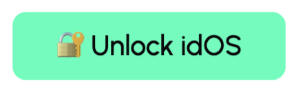
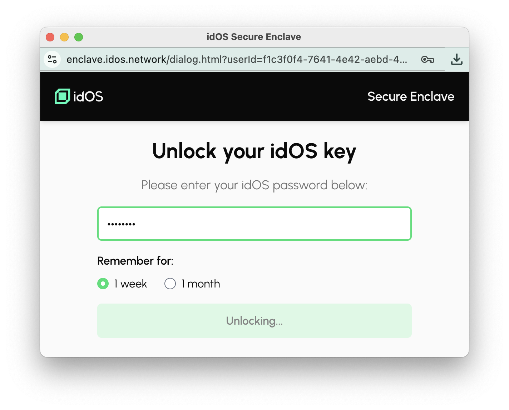

# The idOS Enclave

The [idOS Enclave](https://github.com/idos-network/idos-sdk-js/tree/main/apps/idos-enclave/) is a browser wallet for encryption: a secure sandboxed browser context for key management, encryption, and decryption.

Just like e.g. MetaMask does regarding signatures, the Enclave ensures the user’s private key isn’t accessible by dapps. Whenever data needs to be decrypted, we ask the user to “unlock” the Enclave.

## Creating and recreating idOS keys

When a new user is added to the idOS, we help them create an encryption keypair, and record the public key on their idOS profile. This is the public key that everything will be encrypted to for this user, so the user will always need its corresponding private key whenever decrypting data.

This keypair (or at least its private key) needs to be stored somewhere, which is particularly difficult to do reliably for a web app. An extension like MetaMask can keep it safe indefinitely, but the Enclave will inevitably forget it.

This means the Enclave must be ready to recreate it at any time. To do this, it must use a key generation process that reliably arrives at the same key, again and again, for the same user — whether they’re new or existing.

## Deriving keys from seeds

The Enclave uses the user's chosen password as the seed for their idOS keypair. This is the same for a new user “setting” their password, or a returning user “entering” their password.

The diagram below illustrates how this process works differently for new vs existing users.

### Key derivation details

idOS keys are derived using scrypt (an industry standard [PBKDF](https://en.wikipedia.org/wiki/Key_derivation_function)) to derive a keypair for a user given their seed and user ID.

1. Take a seed (e.g. a user’s password)
2. [Normalize](https://developer.mozilla.org/en-US/docs/Web/JavaScript/Reference/Global_Objects/String/normalize) the seed for consistency across platforms
3. Use [scrypt-js](https://github.com/ricmoo/scrypt-js) to derive a 32-byte private key from a combination of
    1. the normalized seed
    2. the user’s ID, which acts as a [salt](https://en.wikipedia.org/wiki/Salt_(cryptography)) with to help thwart [rainbow table](https://en.wikipedia.org/wiki/Rainbow_table) attacks
4. Use [tweetnacl-js](https://github.com/dchest/tweetnacl-js) to derive the public key from this private key

Voilà, the Enclave now has an encryption keypair (private key + public key), and is now ready to serve encryption and decryption requests coming from the idOS SDK.

## UI flows: button vs popup

When a dapp initializes the idOS frontend SDK, the SDK creates an invisible iframe containing the Enclave. It’s within this invisible iframe that the “Unlock idOS” button appears.

TODO explain why we want to control the button implementation (to prevent popup blockers)

The Enclave tries as much as possible to avoid user interaction, but there are times where that is inevitable. In those cases, the Enclave will need to show the “Unlock idOS” button, and sometimes even to open the Enclave popup.

