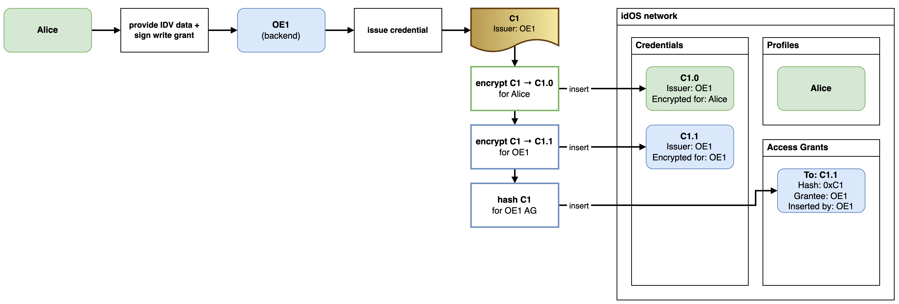
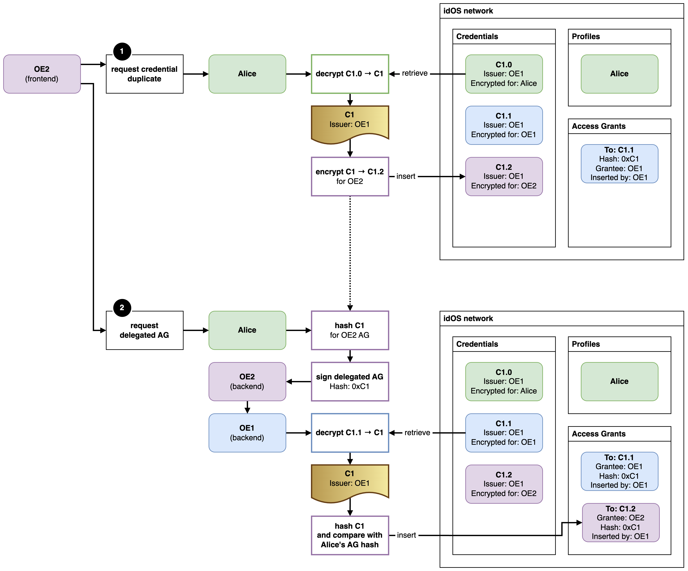

# Passporting

[Passporting](https://docs.idos.network/compliance/kyc-re-usability/passporting) is the legal right for an obliged entity to rely on another obliged entity’s previous KYC/AML efforts under the right circumstances, without requiring users to provide additional data, or perform additional checks on data previously provided.

Let OE1 be an obliged entity who issues idOS credentials, and OE2 be another obliged entity that wants to onboard users holding OE1 credentials.

For passporting to be applicable, the idOS offers mechanisms for OE1 and OE2 to vet each other and establish a contractual relationship, and for OE2 to secure permission from OE1 for every credential OE2 wants to reuse.

## OE onboarding and registry

The idOS network will host a registry of obliged entities (OEs).

This registry is permissioned, and updated via idOS governance. Candidate OEs must provide data for review as per a KYB, and agree to idOS terms.

Successful applicants will be added to the OE registry, and are ready to start reusing credentials from any other onboarded OE.

## Passporting-compliant reusability flow

This flow is a passporting-compliant alternative to idOS’s typical credential sharing. It illustrates how OE2 can reuse a credential issued to Alice by OE1. We assume both OE1 and OE2 were already successfully onboarded into the OE registry.

### Alice gets her first credential from OE1

Alice has a profile in the idOS, but no credentials. She visits OE1, who offers to verify her.

1. OE1 asks Alice for her personal data, and for a write grant
2. Upon successful IDV, OE1:
    1. issues the credential **C1**;
        1. encrypts **C1** for Alice as **C1.0**, and inserts it in the idOS;
    2. encrypts **C1** for itself as **C1.1**, and inserts it in the idOS;
    3. calculates the hash of **C1**;
    4. inserts an AG to **C1.1** in the idOS, containing the hash of **C1**.

### Alice visits OE2 and reuses her credential

Later, Alice visits OE2, who asks her to list her idOS credentials. OE2 finds she has a compatible credential issued by OE1.

1. OE2 asks Alice for an encrypted duplicate of **C1**;
2. Alice then:
    1. retrieves and decrypts **C1.0**, obtaining **C1**;
    2. calculates the content hash of **C1**
    3. encrypts **C1** for OE2 as **C1.2**
    4. Alice inserts **C1.2** it in the idOS

OE2 now has credential **C1.2** in the idOS, but can’t access it yet. To do so compliantly, they must continue the process as follows.

1. OE2 asks Alice for a delegated AG to **C1.2**;
2. Alice:
    1. calculates the hash of C1 and includes it in the AG;
    2. signs the delegated AG to **C1.2**;
3. OE2 sends the delegated AG to OE1;
4. OE1 then does the AG relay process:
    1. retrieves and decrypts **C1.1**, obtaining **C1**;
    2. calculates the hash of **C1**;
    3. aborts if Alice provided a different hash in her AG;
    4. inserts the delegated AG into the idOS, containing the hash of **C1**.

### OE2 ensures safe credential reuse

OE2 can now access **C1.2**, but still needs to make sure **C1.2** was correctly re-encrypted.

OE2 then:

1. retrieves and decrypts **C1.2**, obtaining **C1** (ostensibly)
2. ensures the AG they used was inserted by OE1;
3. hashes **C1** and ensures it matches the hash in the AG.

OE2 can now reuse this credential compliantly.
