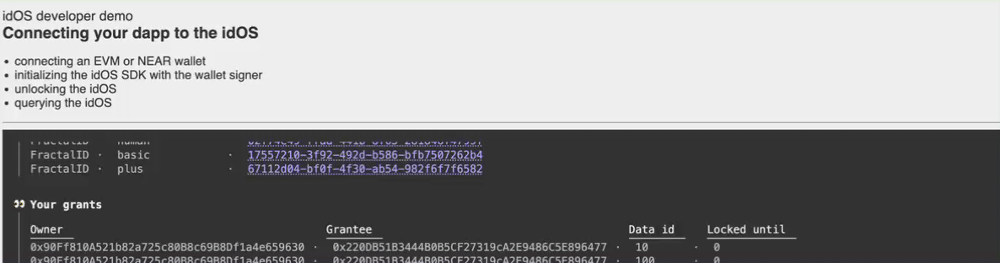
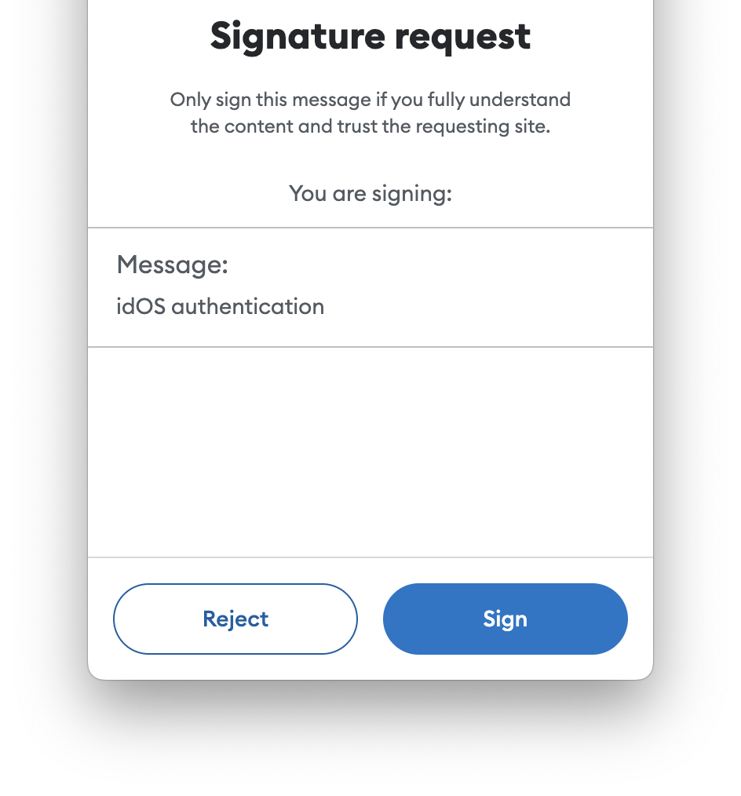
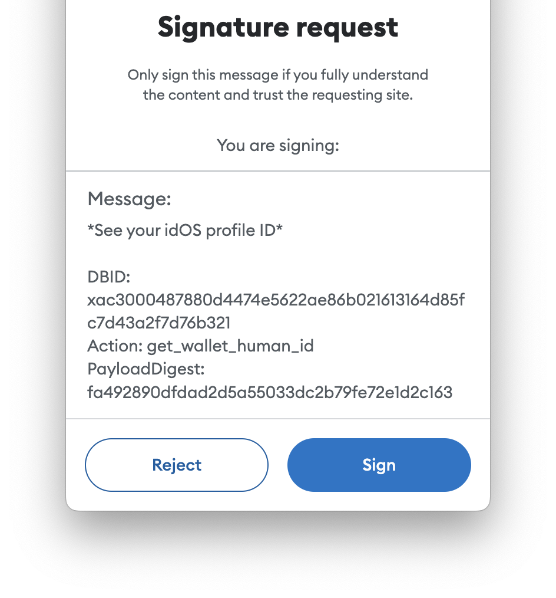
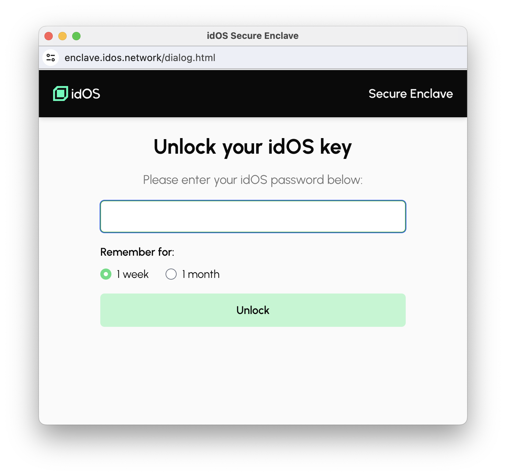

# idOS JavaScript SDK

[](https://www.npmjs.com/package/@idos-network/idos-sdk) 

## Installation

Get [our NPM package](https://www.npmjs.com/package/@idos-network/idos-sdk) with `pnpm add @idos-network/idos-sdk` (or the equivalent of your package manager of choice).

## Quickstart

Create a container anywhere on your page, and ensure it's displayed when assigned the `visible` class.

```html
<div id="idos-container"></div>
```

```css
div#idos-container         { display: none; }
div#idos-container.visible { display: block; }
```

Import the SDK and initialize it with a selector for the container:
```js
import { idOS } from "@idos-network/idos-sdk";

const idos = await idOS.init({ container: "#idos-container" });
```

Connect your user's wallet and use its signer to complete the setup.
```js
await idos.setSigner("EVM", signer); // e.g. ethers.Signer
```

You're all set!
```js
const credentials = await idos.data.list("credentials");
console.log(credentials);
// [{ id: "4f4d...", issuer: "Fractal ID", type: "human" }, ...]

const { id } = credentials[0];
const { content } = await idos.data.get("credentials", id);
const isValid = await idOS.verifiableCredentials.verify(content).catch(e => false);
```

> [!NOTE]
> For more examples and data queries, see:
> * the [quick reference](#quick-reference) below
> * [`📁 idos-example-dapp`](../../main/apps/idos-example-dapp) for a simple implementation
> * [`📁 idos-data-dashboard`](../../main/apps/idos-data-dashboard) for a thorough example

## Diving deeper

### Initialization and the `#idos-container`

```js
import { idOS } from "@idos-network/idos-sdk";

const idos = await idos.init({ container: "#idos-container" });
```

After importing the SDK, you initialize it with a selector string for a DOM node. Make sure to add it to your page:

```html
<div id="idos-container"></div>
```

This container will be used by the SDK to load the idOS secure enclave during initialization. The [`📁 idos-enclave`](../../apps/idos-enclave) is a sandboxed browser context, used to safekeep a keyring for cryptographic operations users need to perform. When the enclave requires user interaction, it uses this container to render UI such as the **`🔓 Unlock idOS`** button.


To avoid surprising your UI, the SDK doesn't make itself visible and sets no CSS properties. Instead, it toggles the `visible` class on this container. This means you retain control over your UI, and need to define what "visible" means, for example:

```css
#idos-container {
  display: none;
}

#idos-container.visible {
  display: block;
}
```
This barebones setup is enough to get you started, but you can naturally style and animate the container as you like, for example within a toast component.

Our [`📁 idos-example-dapp`](../../apps/idos-example-dapp) shows an example of blending this into a UI. It wraps the container and floats it over the page, and animates its opacity when the `visible` class is applied. You can see it below (pulsating forcefully to illustrate the point):



### The `setSigner` flow and supported wallets

```js
const { humanId } = await idos.setSigner("EVM", signer);
```

All queries to idOS nodes require a valid signature. These are performed by your user's wallet, whose signer must be passed to the SDK via the `setSigner` method. During the `.setSigner` process, the SDK will endeavour to remember or learn two things:
1. a public key for this signer;
2. the idOS human ID of the user controlling this signer.

The SDK first attempts to recall both from local storage and from the secure enclave. If it can't, it will engage with the signer. In this scenario, the SDK first requests a signed message from which it can extract the public key. Finally, it performs the first idOS query: asking it for the ID of the user controlling the signer.

Your user's wallet will be triggered when this happens, so you should be mindful of when in your user's journey you call this method. Here's how these requests appear in MetaMask.

<table border="0"><tr align="center">
  <td><i>Asking the signer for a public key:</i></td>
  <td><i>Fetching the human ID from idOS:</i></td>
</tr><tr align="center">
  <td></td>
  <td></td>
</td></tr></table>

The idOS currently supports two classes of signers:
* Ethereum/EVM wallets (like MetaMask or Trust Wallet) producing [EIP-191](https://eips.ethereum.org/EIPS/eip-191) `secp256k1` signatures (aka `personal_sign`)
* NEAR/NVM wallets (like MyNearWallet or Meteor) producing [NEP-413](https://github.com/near/NEPs/blob/master/neps/nep-0413.md) `ed25519` signatures (aka `signMessage`)

### The idOS password

Most data stored in the idOS is encrypted such that only its owner (your user) can make sense of it. Since key management is neither a common nor an expectable practice among non-technical folks, this key is derived from a password chosen by the user. The key derivation process is handled by the idOS secure enclave to enable users to perform [authenticated asymmetric ECC encryption / decryption](https://cryptobook.nakov.com/asymmetric-key-ciphers/elliptic-curve-cryptography-ecc#curve25519-x25519-and-ed25519).


Since the SDK does have access to this key, it delegates decryption workloads to the enclave when responding to data requests involving. This happens transparently when you use the SDK to read encrypted data from the idOS.


Users can control how long the enclave remembers this key for. When that period expires, or when faced with a new signer, the enclave will prompt the user. It first brings the idOS container into view as shown above and, after the user clicks the **`🔓 Unlock idOS`** button, a secure dialog opens where the user can safely enter their password.

<table border="0"><tr align="center"><td>
  <i>The password dialog</i>
</td></tr><tr align="center"><td>
  
</td></tr></table>


## Quick reference

### Importing and initializing

```js
import { idOS } from "@idos-network/idos-sdk";

idos = await idOS.init({ container: "css selector" });
```

### EVM signer setup

```js
const provider = new ethers.BrowserProvider(window.ethereum);
await provider.send("eth_requestAccounts", []);
const signer = await provider.getSigner());

const { humanId } = await idos.setSigner("EVM", signer);
```

### NEAR signer setup

```js
const {
  defaultContractId: contractId,
  contractMethods: methodNames,
  defaultNetwork: network
} = idOS.near;

const selector = await setupWalletSelector({
  network,
  modules: [setupMeteorWallet(), setupMeteorWallet()],
});

!selector.isSignedIn() && await new Promise(resolve => {
  const modal = setupModal(selector, { contractId, methodNames });

  modal.on("onHide", resolve);
  modal.show();
});

const signer = selector.wallet();

const { humanId } = await idos.setSigner("NEAR", signer);
```

### idOS profile


```js
if (humanId) { /* user has an idOS profile */ }
```

If your user does not have an idOS profile, you can send them to Fractal ID for them to get one, by redirecting them to the first URL in `idOS.profileProviders`. By using that URL, you agree to [Fractal ID's Terms of Service](https://web.fractal.id/wp-content/uploads/2023/11/Onboarding-link.pdf).

```js
if (!humanId) window.location = idOs.profileProviders[0];
```

### Credentials

```js
const credentials = await idos.data.list("credentials");
const credentials = await idos.data.list("credentials", { issuer: "Fractal ID" };

const { id } = credentials.find(c => c.credential_type === "basic");

const { content } = await idos.data.get("credentials", id);

const isValid = await idOS.verifiableCredentials.verify(content).catch(e => false);
```

### Creating / updating / deleting data

```js
const { id } = await idos.data.create("attributes", {
  attribute_key: "highScore",
  value: "10",
});

await idos.data.update("attributes", { id, value: "1000" });

await idos.data.delete("attributes", id);
```
