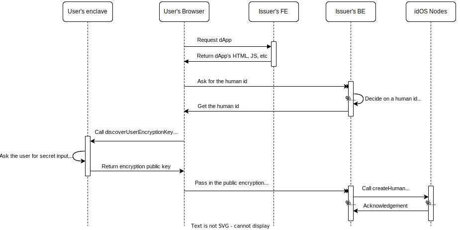

# idOS Issuer JavaScript SDK

[](https://www.npmjs.com/package/@idos-network/issuer-sdk-js) 

## Installing

Get [our NPM package](https://www.npmjs.com/package/@idos-network/issuer-sdk-js) and its dependencies with pnpm or the equivalent of your package manager of choice:

```bash
pnpm add @idos-network/issuer-sdk-js
```

## Before you start

When using this package, you're going to need to be familiar with how a dApp works with the idOS. Make sure you read [idos-sdk-js's README](https://github.com/idos-network/idos-sdk-js/tree/main/packages/idos-sdk-js#readme) before you proceed.

## Setting up

Create an issuer config with your secret key. This config will be used to interact with the idOS.

```js
// issuer-config.js
import { createIssuerConfig } from "@idos-network/issuer-sdk-js";
import { Wallet } from "ethers";

const wallet = new Wallet("YOUR_PRIVATE_KEY");

const issuerConfig = await createIssuerConfig({
  // To use a non-prod environment, pass in "nodes.playground.idos.network".
  nodeUrl: "https://nodes.idos.network/",
  // The encryption and signing key pairs can be generated using the `nacl` library. You can take a look at https://github.com/idos-network/idos-sdk-js/blob/335dc9b72999393ec25571e3960e6ca108486260/packages/issuer-sdk-js/src/create-issuer-config.ts for an example.
  encryptionKeyPair: "YOUR_ENCRYPTION_KEY_PAIR",
  signingKeyPair: "YOUR_SIGNING_KEY_PAIR"
});
```

## Creating a human profile

This procedure can only be done by a Permissioned Issuer. Get in touch with us at engineering@idos.network if you're interested in being one.

To create a human profile in idOS, you need:
1. **A wallet address** associated with the human.
2. **A public encryption key** derived from either a password or a passkey chosen by the user in the idOS enclave app.

### Human Creation Process



#### Step 1: Decide on a human id

Deciding on a human id for a user is an issuer decision. You can use whichever you want, as long as it's an [UUID](https://en.wikipedia.org/wiki/Universally_unique_identifier).

```js
// Server side

const humanId = crypto.randomUUID();

// Remember it on your database
session.user.update({ humanId })

// Return it to the front-end to be used in the next step
return { humanId }
```

#### Step 2: Derive the Public Key

Use the `idos.discoverEncryptionKey` function to derive a public key for the human. This key will be used to encrypt and decrypt human's credential content.

```javascript
// Client side

import { idOS } from "@idos-network/idos-sdk-js";

// Arguments are described on idos-sdk-js's README. Be sure to read it.
const idos = await idOS.init(...);

// Get humanId associated with this user from your server
const { humanId } = await yourServer.getIdosInformation();

// Discover user encryption key
const { encryptionPublicKey } = await idos.discoverEncryptionKey(humanId);

// Report it back to your server
await yourServer.reportIdosEncryptionPublicKey(encryptionPublicKey);
```


#### Step 3: Creating a Human Profile
Once the public key is derived, you can create the human profile in idOS by passing it to the `createHuman` function alongside with human id and the wallet the user's going to use to drive their idOS profile.

```javascript
// Server side

import { createHuman } from "@idos-network/issuer-sdk-js";
import issuerConfig from "./issuer-config.js";

// Get this from the user's request, and remember it
const currentPublicKey = request.params['userEncryptionPublicKey']
session.user.currentPublicKey = currentPublicKey

// Get the stored human id
const humanId = session.user.humanId

// Build the human object
const human = {
  id: humanId,
  current_public_key: currentPublicKey,
}

// Build the wallet object
const walletPayload = {
  // The user's wallet address (e.g., an Ethereum address)
  address: "0x0",
  // The type of user wallet (e.g., "EVM", "NEAR")
  wallet_type: "EVM",
  // The message that was signed by the address
  message: "app wants you to sign this message...",
  // The derived signature for the message, created with the user wallet
  signature: "0x3fda8a9fef767d974ceb481d606587b17c...",
  // The user wallet's public key
  public_key: "RxG8ByhoFYA6fL5X3qw2Ar9wpblWtmPp5MKtlmBsl0c=",
}

// Create the user on idOS nodes, and get some information back.
const [profile, wallet] = await createHuman(issuerConfig, human, walletPayload);
```

## Writing credentials

In order to write a credential to idOS, the issuer needs to obtain permission from the user. This can be done in two ways: using Write Grants, or using Permissioned Credential Creation. Below are the two methods for writing credentials.

### Using Write Grants
The first method involves getting permission from the user via a Write Grant.

A Write Grant is a permission given by the user that allows a specific grantee to perform a few operations on their behalf. This is particularly relevant to not require the user to come back to your website if you want to add data to their profile.

To do this, you must first create a Write Grant using the idOS SDK. Here's an example of creating a write grant, by calling the [idos.data.addWriteGrant](https://github.com/idos-network/idos-sdk-js/tree/main/packages/idos-sdk-js#write-grants):

```js
// Client side

import { idOS } from "@idos-network/idos-sdk-js";

// Arguments are described on idos-sdk-js's README. Be sure to read it.
const idos = await idOS.init(...);

// This is a placeholder for your signer's address. You could get it from
// some endpoint you expose. But, to keep it simple, we're using a constant.
const ISSUER_SIGNER_ADDRESS = "0xc00ffeec00ffeec00ffeec00ffeec00ffeec00ff";

// Ask the user for a Write Grant
await idos.data.addWriteGrant(ISSUER_SIGNER_ADDRESS);
```

Now that the user has created a Write Grant for us, the issuer, we can create a credential for the user:

```js
// Server side

import { createCredentialByGrant, encryptionPublicKey } from "@idos-network/issuer-sdk-js";
import issuerConfig from "./issuer-config.js";

const credential = {
  // The user id of the human who is creating the credential.
  humanId: session.user.humanId,
  // Fields in the `publicNotes` field are fields that are public and can be used by dApps to select the appropriate credential when acquiring an Access Grant.
  // You should decide on what's the most helpful content they can have.
  publicNotes: JSON.stringify({
    type: "human",
    level: "human",
    status: "approved", 
    
    // make yourself discoverable by dApps.
    issuer: "MyCoolIssuer",
  }),
  // The verifiable credential content should be passed as is see example at https://verifiablecredentials.dev/ usually a stringfied JSON object.
  // `createCredentialByGrant` will encrypt this for us, using the Issuer's secret encryption key, along with the user's public encryption key.
  
  plainTextContent: "VERIFIABLE_CREDENTIAL_CONTENT",
  
  // The public encryption key of the user who is creating the credential.
  receiverEncryptionPublicKey: session.user.userEncryptionPublicKey,
}

const credential = await createCredentialByGrant(issuerConfig, credential);
```

This will create a credential in the idOS for the given grantee address.


> ⚠️ Notice
>
> The credential content should be passed as is. It will be encrypted for the recipient before being stored on the idOS.


### Using Permissioned Credential Creation
The second method allows the issuer, by virtue of being a Permissioned Issuer, to create a credential without a Write Grant. Get in touch with us at engineering@idos.network if you're interested in being one.

For this method, use the `createCredentialPermissioned` function to write the credential with the necessary encryption.

Example:

```js
// Server side

import { createCredentialPermissioned } from "@idos-network/issuer-sdk-js";
import issuerConfig from "./issuer-config.js";

// See the previous example for more details on these fields
const credential = {
  humanId: session.user.humanId,
  plainTextContent: "VERIFIABLE_CREDENTIAL_CONTENT",
  publicNotes: JSON.stringify({
    type: "human",
    level: "human",
    status: "approved", 
    issuer: "MyCoolIssuer",
  }),
  content: "VERIFIABLE_CREDENTIAL_CONTENT",
  receiverEncryptionPublicKey: session.user.userEncryptionPublicKey,
}

await createCredentialPermissioned(issuerConfig, credential);
```

### Revoking a credential
A previously created credential can be revoked by the issuer by calling the `editCredential` function. When creating a credential, the `publicNotes` field needs to have an `id` field that will be used to identify the credential to be revoked. Pass this `id` to the `editCredential` function to revoke the credential.

```js
// Server side

import { editCredential } from "@idos-network/issuer-sdk-js";
import issuerConfig from "./issuer-config.js";

await editCredential(issuer, {
    publicNotesId: id, // the `id` of the credential to be revoked that is stored in the `publicNotes` field.
    publicNotes: JSON.stringify({
      ...publicNotes,
      credential_status: "revoked" // updating the credential status to revoked
    }),
  });
```


## Developing the SDK locally

Run:
```bash
pnpm dev
```

This will start the compiler in watch mode that will rebuild every time any of the source files are changed.

You can also create a production build by running the following command in the root folder of the SDK package:

```bash
pnpm build
```
